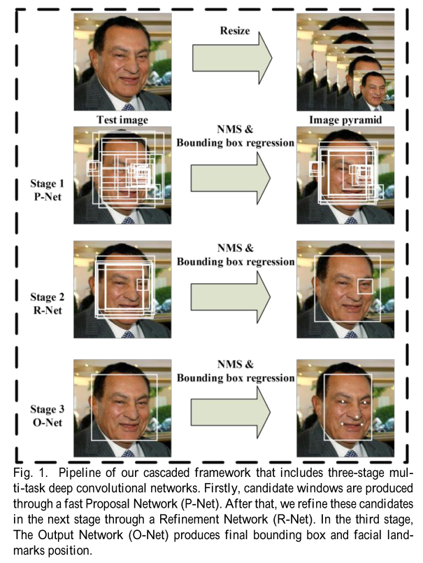
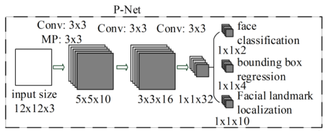
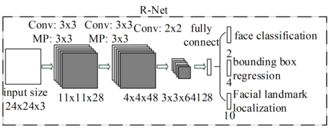
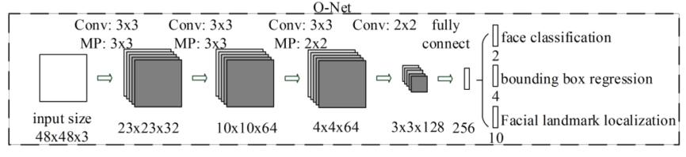
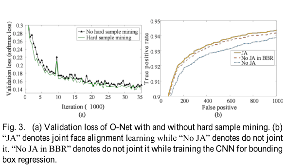
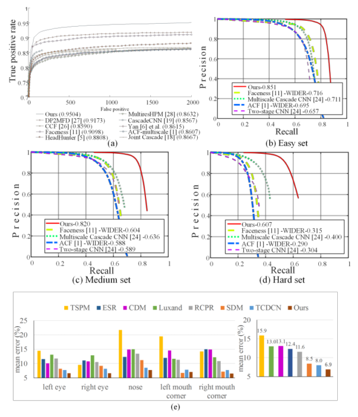

# Paper
---------
- **Title**: Joint Face Detection and Alignment using Multi - task Cascaded Convolutional Networks
- **Authors**: Kaipeng Zhang, Zhanpeng Zhang, Zhifeng Li, Senior Member, IEEE, and Yu Qiao, Senior Member, IEEE
- **Tag**:Face detection, face alignment, cascaded convolutional neural network
- **Journal**: Spl
- **Year**:2016
- **Link**:https://arxiv.org/abs/1604.02878

# Summary
________
### what
- They propose a new framework to integrate face detection and alignment tasks using unified cascaded CNNs by multi-task learning. 

- They propose an effective method to conduct online hard sample mining to improve the performance.

- Thet get significant performance improvement of the proposed approach compared to the state-of-the-art techniques in both face detection and face alignment tasks.

  
### why
- The performance of existed multiple CNNs for face detection is limited by the following facts: 

  - (1) Some filters lack diversity of weights that may limit them to produce discriminative description. 
  - (2) Compared to other multi-class objection detection and classification tasks, face detection is a challenge binary classification task, so it may need less numbers of filters but more discrimination of them. 

- mining hard samples in training is critical to strengthen the power of detector. However, traditional hard sample mining usually performs an offline manner, which significantly increases the manual operations. It is desirable to design an online hard sample mining method for face detection and alignment, which is adaptive to the current training process automatically.
### how
- The proposed CNNs consist of three stages. 
  - first stage: it produces candidate windows quickly through a shallow CNN (Proposal Network,P-Net).

  - second stage: it refines the windows to reject a large number of non-faces windows through a more complex CNN (Refinement Network, R-Net).

    

  - third stage: it uses a more powerful CNN to refine the result and output final bounding box and facial landmarks positions (Output Network, O-Net).
- APPROACH
  - Given an image, we initially resize it to different scales to build an image pyramid, which is the input of the following three-stage cascaded framework
  - Stage 1: We exploit a fully convolutional network, called Proposal Network (P-Net), to obtain the candidate windows and their bounding box regression vectors. Then we use the estimated bounding box regression vectors to calibrate the candidates. After that, we employ non-maximum suppression (NMS) to merge highly overlapped candidates.
  - Stage 2: all candidates are fed to another CNN, called Refine Network (R-Net), which further rejects a large number of false candidates, performs calibration with bounding box regression, and NMS candidate merge.
  - Stage 3: This stage is similar to the second stage, but in this stage we aim to describe the face in more details. In particular, the network will output five facial landmarks’ positions.
  - we reduce the number of filters and change the 5×5 filter to a 3×3 filter to reduce the computing while increase the depth to get better performance.
- we do online hard sample mining in face classification task to be adaptive to the training process.
- In each mini-batch, we sort the loss computed in the forward propagation phase from all samples and select the top 70% of them as hard samples. Then we only compute the gradient from the hard samples in the backward propagation phase. Experiments show that this strategy yields better performance without manual sample selection.

### Results
- The effectiveness of online hard sample mining
- The effectiveness of joint detection and alignment
- Evaluation on face detection
- Evaluation on face alignment In

# Problem
- how does online hard sample mining work?